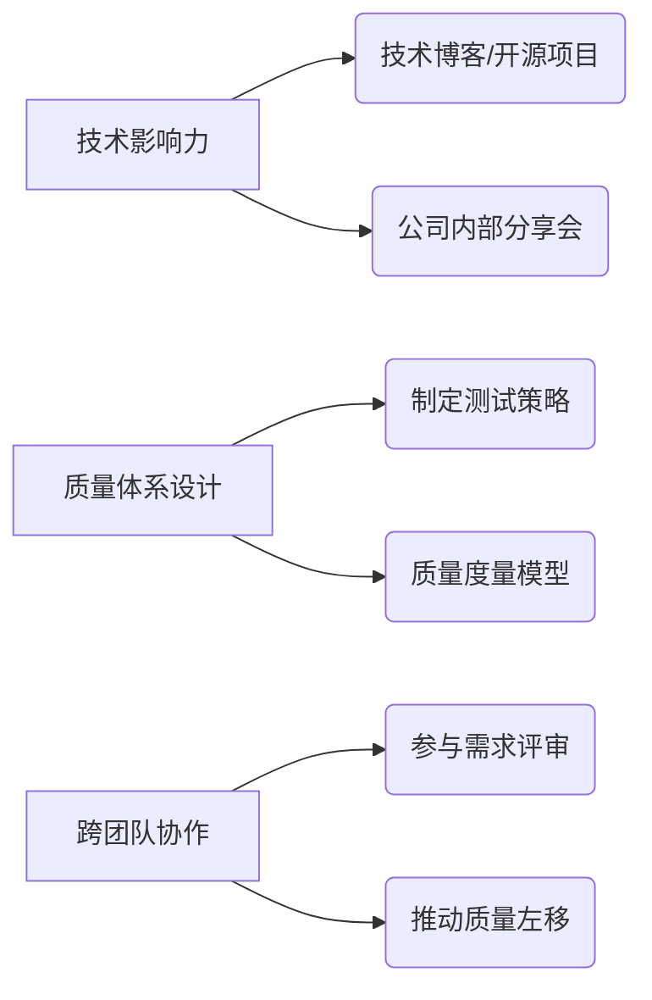

以下是为您量身定制的**从初级测试工程师到高级测试开发工程师的进阶学习计划**，结合您现有的项目与云服务器资源，分为6个阶段系统化推进，每个阶段包含学习目标、具体行动、产出物及时间建议。

---

### **核心能力目标**
| 能力维度       | 初级→高级进阶要点                 |
| -------------- | --------------------------------- |
| **测试基础**   | 需求分析→复杂系统质量保障体系设计 |
| **自动化能力** | 脚本编写→框架设计/效能平台开发    |
| **开发能力**   | 基础语法→系统架构/高并发处理      |
| **工程化能力** | 工具使用→CI-CD/DevOps流水线建设   |
| **新技术应用** | 功能测试→AI测试/云原生测试方案    |

---

### **分阶段学习清单（总周期约12-18个月）**
#### **阶段1：自动化能力筑基（1-3个月）**
| 学习重点       | 具体行动                                                     | 产出物                     | 资源利用               |
| -------------- | ------------------------------------------------------------ | -------------------------- | ---------------------- |
| **Python进阶** | 掌握pytest+requests+allure生态链，深入装饰器/多线程/异步编程 | 封装企业级HTTP/DB测试库    | 在云服务器部署测试环境 |
| **接口自动化** | 对现有项目接口实现90%覆盖率自动化，集成Mock服务应对异常场景  | 可维护的接口自动化测试套件 | 项目API文档+Postman    |
| **Web自动化**  | 基于Selenium 4.0实现关键业务流程自动化，应用Page Object设计模式 | 核心业务流自动化脚本       | 项目前端环境           |
| **持续集成**   | 在云服务器搭建Jenkins，配置自动化测试定时执行与报告推送      | 每日自动化测试报告邮件     | 云服务器+Git仓库       |

---

#### **阶段2：测试开发深度拓展（3-6个月）**
| 学习重点         | 具体行动                                                     | 产出物                 |
| ---------------- | ------------------------------------------------------------ | ---------------------- |
| **测试框架开发** | 开发定制化测试框架（支持数据驱动/关键字驱动），集成日志/告警/多环境配置 | 自主研发测试框架v1.0   |
| **效能工具开发** | 开发用例管理工具（Django+React），实现用例与Bug联动          | 内部测试管理系统       |
| **性能测试**     | 使用Locust编写性能脚本，在云服务器部署分布式压测，分析JVM调优策略 | 系统性能瓶颈报告       |
| **Docker实战**   | 容器化测试环境（Selenium Grid+Jenkins），实现环境秒级启动    | Docker-compose部署方案 |

---

#### **阶段3：架构与工程化（6-9个月）**
| 学习重点         | 具体行动                                                     | 产出物                  |
| ---------------- | ------------------------------------------------------------ | ----------------------- |
| **微服务测试**   | 基于现有项目实践契约测试（Pact），网关流量录制回放           | 微服务API兼容性测试方案 |
| **DevOps流水线** | 设计GitLab CI流水线：代码扫描→单元测试→自动化部署→自动化测试→安全扫描 | 全链路CI-CD流水线       |
| **质量中台建设** | 搭建TestOps平台：集成用例管理/执行调度/覆盖率分析/质量看板   | 可视化质量监控系统      |
| **云原生测试**   | 在云服务器部署K8s集群，实践混沌工程（Chaos Mesh）            | 系统容错性测试报告      |

---

#### **阶段4：高阶技术突破（9-12个月）**
| 学习重点       | 具体行动                                                     | 产出物                     |
| -------------- | ------------------------------------------------------------ | -------------------------- |
| **AI测试应用** | 开发智能测试用例生成工具（NLP+历史用例），实现日志异常模式识别 | AI辅助测试工具原型         |
| **大数据测试** | 构建数据质量监控管道（Great Expectations），验证数仓数据一致性 | 数据血缘测试方案           |
| **安全测试**   | 集成OWASP ZAP进行自动化安全扫描，实践SAST/DAST               | 安全测试报告（含修复建议） |
| **移动端专项** | 使用Appium进行弱网/耗电/内存泄漏测试，集成云真机平台         | 移动端性能优化指南         |

---

#### **阶段5：技术领导力塑造（持续进行）**


---

### **关键行动建议**
1. **项目驱动学习**  
   - 每学新技术立即在现有项目落地（如用Docker重构测试环境）
   - 在云服务器搭建**测试技术沙箱**：Jenkins+GitLab+Prometheus+Grafana

2. **成果物沉淀**  
   ```markdown
   - GitHub仓库分类：
     ├── auto_framework (自制测试框架)
     ├── test_platform (测试效能工具)
     ├── performance_scripts (性能方案)
     └── cloud_config (云环境部署脚本)
   ```

3. **能力认证选择**  
   - 优先考取：**CSTE（认证测试工程师）→ ISTQB高级**
   - 技术认证：**AWS/Azure云认证 → K8s CKA认证**

---

### **学习资源清单**
| 类型       | 推荐资源                                                  |
| ---------- | --------------------------------------------------------- |
| **书籍**   | 《Google软件测试之道》《持续交付》《SRE：Google运维解密》 |
| **平台**   | Udemy进阶课：**Test Automation University**               |
| **社区**   | TesterHome社区                                            |
| **工具链** | 官方文档：**pytest/Selenium/Locust/Jenkins/K8s**          |

> 注：本计划可根据实际进度动态调整，建议每阶段结束进行**能力差距分析**。如需各阶段详细技术方案或遇到卡点，可随时沟通续订计划。**高级测试开发工程师的核心价值在于通过技术手段显著提升质量效能**，现在就开始用您的项目与云服务器打造第一个自动化资产吧！